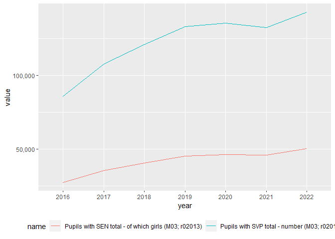
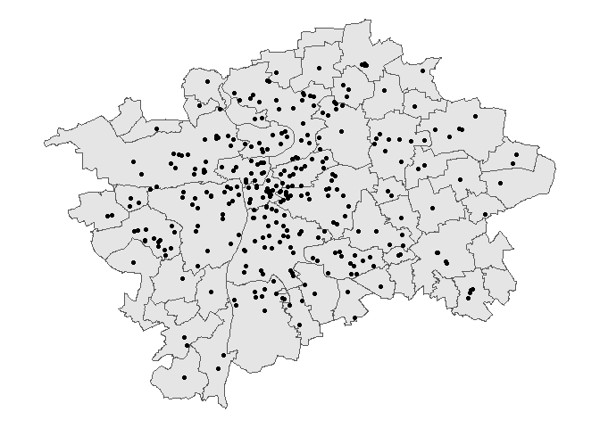
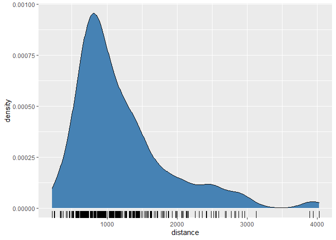
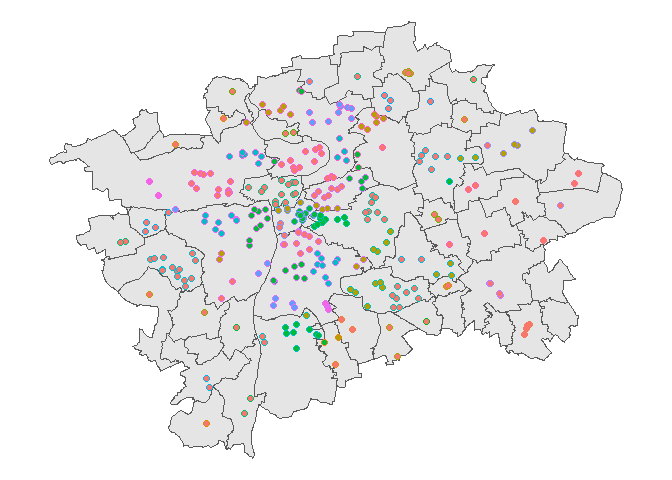
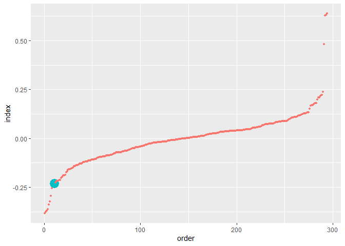

<!-- README.md is generated from README.Rmd. Please edit that file -->

# MSMT (ALPHA VERSION)

<!-- badges: start -->
<!-- badges: end -->

The goal of **MSMT** is to facilitate the access to and use of
administrative data collected by Czech Ministry of Education, Youth and
Sports (further on referred to as *MSMT data*).

## Installation

You can install the working version of **MSMT** from GitHub with:

``` r
library(devtools)
install_github("jmunich/MSMT")
```

To load **MSMT**, run:

``` r
library(MSMT)
```

## **MSMT** data structure

The data is collected on a regular basis using standardized forms filled
in by directors of schools and other educational institutions.

There are different types of forms for different types of
establishments, each with a unique code. Function **msmt_forms** was
designed to facilitate the browsing of available forms and variables.
First, we can look at what forms there are:

``` r
all_forms <-  msmt_forms(language = "en")
all_forms
#> # A tibble: 23 x 5
#>    form  vykaz name                                                  first  last
#>    <chr> <chr> <chr>                                                 <int> <int>
#>  1 S01   01    Kindergarten report                                    2015  2022
#>  2 Z02   02    Report on the after-school club                        2015  2022
#>  3 M03   03    Primary school report                                  2015  2022
#>  4 S04   04    Statement on the nursery-primary school at the healt~  2015  2022
#>  5 S4c   4c    Report on the preparatory class of primary school an~  2015  2022
#>  6 S05   05    Report on applicants enrolled and admitted to the fi~  2015  2019
#>  7 M08   08    Secondary school report                                2015  2022
#>  8 M09   09    Statement about the Conservatory                       2015  2022
#>  9 M10   10    Statement of the higher vocational school              2015  2022
#> 10 R13   13    Report on school directorates                          2015  2022
#> # ... with 13 more rows
```

Package **MSMT** currently provides the original labels in Czech and an
English translation created using R package **deeplr**.

Each form consists of tables in which the respondents report mostly
count data. These tables then represent sets of variables, grouped by a
similar topic. We can have a look at the approximation of the original
tables, for instance primary school form **M03**, table with Special
Educational Needs (SEN, or SVP in the original - as can be seen, the
automated translation is not yet perfect):

``` r
# English
forms_tables <- msmt_forms(what = "tables",
           language = "en")
forms_tables$M03$`02`
#> # A tibble: 12 x 3
#>    row_ind `2`                                                             `3`  
#>    <chr>   <chr>                                                           <chr>
#>  1 01      Pupils with SVP total - number                                  Pupi~
#>  2 02      of which the health. with disabilities - number                 of w~
#>  3 03      of which with a different health. with other disabilities - nu~ of w~
#>  4 04      of which different cultural and living conditions - number      of w~
#>  5 05      of which category K - number                                    in t~
#>  6 06      of which category Z - number                                    of w~
#>  7 07      of which category V - number                                    of w~
#>  8 08      of which with extended duration of education - number           of w~
#>  9 09      of which with modified outputs - number                         of w~
#> 10 11      Gifted pupils - number                                          Gift~
#> 11 12      of which exceptionally gifted - number                          of w~
#> 12 20      Pupils with a PO with NFN code - number                         Pupi~
```

Function **msmt_forms** can be also used to search for forms and
variables containing specific terms. Say, we search for variables
containing “SEN”.

``` r
matching_forms <- msmt_forms(what = "search",
           language = "en",
           search_string = "SEN",
           exact_match = FALSE)
matching_forms
#> # A tibble: 11 x 8
#>    polozka zkr                         form  name  item  tab_ind row_ind col_ind
#>    <chr>   <chr>                       <chr> <chr> <chr> <chr>   <chr>   <chr>  
#>  1 r02013  Children with SEN total - ~ S01   Kind~ r020~ 02      01      3      
#>  2 r02013  Pupils with SEN total - of~ M03   Prim~ r020~ 02      01      3      
#>  3 r02012  Pupils with SEN in full-ti~ M08   Seco~ r020~ 02      01      2      
#>  4 r02013  Pupils with SEN in full-ti~ M08   Seco~ r020~ 02      01      3      
#>  5 r15013  Total education - pupils w~ M08   Seco~ r150~ 15      01      3      
#>  6 r15013a Total education - pupils w~ M08   Seco~ r150~ 15      01      3a     
#>  7 r02012  Pupils with SEN in full-ti~ M09   Stat~ r020~ 02      01      2      
#>  8 r02013  Pupils with SEN in full-ti~ M09   Stat~ r020~ 02      01      3      
#>  9 r15013  Total education - students~ M10   Stat~ r150~ 15      01      3      
#> 10 r15013a Total education - students~ M10   Stat~ r150~ 15      01      3a     
#> 11 r02013  Children with SEN total - ~ Z14   Repo~ r020~ 02      01      3
```

Finally, to facilitate quick browsing through forms, tables and
variables, it is possible to use the “browser” option, returning a named
list that can be easily browsed in R using the **\$** operator to find
variable codes. In the example bellow, we get variable names for the
number of pupils with SEN in total and the number of girls with SEN.

``` r
browser_forms <- msmt_forms(what = "browser", language = "en")

SEN_varname <- browser_forms$`Primary school report; form M03`$`Pupils with SVP total - number; etc. ; tab. 02`$`Pupils with SVP total - number; var. r02012`
SEN_girl_varname <- browser_forms$`Primary school report; form M03`$`Pupils with SVP total - number; etc. ; tab. 02`$`Pupils with SEN total - of which girls; var. r02013`

SEN_varname
#> [1] "r02012"
SEN_girl_varname
#> [1] "r02013"
```

## MSMT identifiers

Most **MSMT** data come with four identifiers, three of them nested:

-   **year** The year represented in the data.
-   **red_izo** The identifier of a headmaster or a director office,
    sometimes managing multiple schools.
-   **izo** Nested under *red_izo*. The identifier of individual
    facility, e.g. under one *red_izo*, there can be an *izo* for a
    primary school and another izo for a preschool.
-   **p_izo** Nested under *izo*. The location identifier, e.g. under
    one *izo* of a primary school, there can be two separate buildings
    with their own *p_izo*.

## Downloading MSMT data

Let’s have a look at the gender of children with Special Educational
Needs. We will first download the data for primary schools from form
**M03**. Then, we can read the data, using function **msmt_read_data**.

``` r
data_locations <- msmt_download_data(form = "M03", 
                                     years = 2016:2022) # We start with 2016, 
data_list <- msmt_read_data(data_locations = data_locations) # as many variables
                                              # are not available in 2015 forms.
```

The data in forms come in two formats, a wide format, where each row
represent a unique school facility and long format, where multiple rows
can represent the same facility. Most variables are reported in the wide
format, long format usually contains counts of pupils per nationality
and similar information. Here, we select the wide data and choose
variable **year** and our pair of selected variables. It is possible to
replace variable codes by using **msmt_names**.

``` r
# Extract only wide data and 
data_use <- data_list$wide[,c("year", SEN_varname, SEN_girl_varname)]
# Assign labels
data_named <- msmt_names(data = data_use, form = "M03", language = "en")
names(data_named)
#> [1] "year"                                                
#> [2] "Pupils with SVP total - number (M03; r02012)"        
#> [3] "Pupils with SEN total - of which girls (M03; r02013)"
```

Now, we can start studying the gender structures of SEN in primary
education.

``` r
library(tidyverse)

data_named %>%
  group_by(year) %>%
  summarise_all(sum, na.rm = TRUE) %>%
  pivot_longer(-year) %>%
  ggplot(aes(x = year, y = value, color = name)) +
  geom_path(aes(group = name)) +
  theme(legend.position = "bottom") +
  scale_y_continuous(labels = scales::comma) +
  theme()
```



## Spatial dimensions of MSMT data

Schools are situated not only in time, but also in space. **MSMT**
contains several functions that facilitate the use of space in analysis.
Let’s have a look at the spatial dimensions of special educational
needs. First, we download the address data and complete it with
coordinates:

``` r
addresses_prague <- msmt_addresses(NUTS3 = "CZ010") # Download address data
                                                    #(Prague only, to save time)
addresses_prague_coord <- msmt_coordinates(addresses_prague) # Append the data 
                                                             # with coordinates
addresses_prague_coord_elschool <- addresses_prague_coord %>% # Extract primary 
  filter(p_izo %in% data_list$wide$p_izo)                     # schools using  
                                  # the building identifier from our data on SEN
```

Having the coordinates, we can situate our schools in space.



**MSMT** also contains a function **msmt_distances** that computes a
matrix of distances between schools. The matrix can be used for several
purposes. First, we can study the proximity of schools to each other
itself, for instance, to simply see, how far every school is from it’s
fifth nearest school:

``` r
library(stats)
msmt_dmat <- msmt_distances(id = data_coord$p_izo, # Get distance matric
                            X = data_coord$MistoRUAINKod_X, 
                            data_coord$MistoRUAINKod_Y)
#> 
#> 
#> Computing distance matrix (this might take a while)

clst_dmat <- as.dist(drop_units(msmt_dmat[coord_object$p_izo, # Select schools 
                                          coord_object$p_izo]))

min_dists <- clst_dmat %>% 
  apply(MARGIN = 1, function(x){sort(x)[5]}) # For every school, get distance to
                                             # fifth nearest school
```



Second, we can see, how school cluster in space. Given that the Czech
school system is very fragmented with many extremely small schools,
creating groups of schools for analytic purposes can be very helpful.
Functions such as **hclust** or **kmeans** can be very helpful in this
regard.

``` r
cluster_object <- hclust(clst_dmat,
                         method = "average")

a_groups <- cutree(cluster_object, h = 2000) 
```



Finally, we can use the distances to match schools to other schools in
their surroundings and analyze variables in their local contexts.
Consider the following:

Each school functions in an area with $N_t$ special needs children, out
of which $N_g$ are girls. Within the area, the children are somehow
distributed among schools.

When there is no gender bias, the proportion of SEN girls in a school
$\frac{n_g}{n_t}$ should be approximately equal to the total proportion
in the area $\frac{N_g}{N_t}$.

Matching every school to it’s neighboring schools allows us to use the
original two variables and construct a gender bias in SEN index:
$I = \frac{n_g}{n_t}-\frac{N_g}{N_t}$. Negative values mean, that the
school has a lower proportion of girls, than it would have under a
gender-independent distribution across schools. Positive values on the
other hand mean, that the school has more girls, than it would have
under a gender-neutral distribution.

The index can be completed with a $\chi^2$ statistical test of
independence.

As shown in the plot bellow, there is only one primary school in Prague,
displaying above chance levels of (at corrected $\alpha = .00005$) bias.
This school over-represents SEN boys. In a closer inspection, this turns
out to be a school specializing on children with behavioral disorders
such as ADHD, more often diagnosed in boys.

``` r
msmt_nearest_schools <- msmt_nearest(msmt_dmat, 
                                     dist = 2000, # For every school, get all  
                                     format = "tibble")$dist # schools within
                                                             # a 2 km radius

values_t <- data_named %>% # Get number of SEN pupils for schools
  mutate(p_izo = data_list$wide$p_izo) %>%
  na.omit() %>%
  filter(year == "2022") %>%
  mutate(value = `Pupils with SVP total - number (M03; r02012)`)

values_g <- data_named %>% # Get numberf of SEN girls
  mutate(p_izo = data_list$wide$p_izo) %>%
  na.omit() %>%
  filter(year == "2022") %>%
  mutate(value = `Pupils with SEN total - of which girls (M03; r02013)`)

counts_t <- values_t$value %>% `names<-`(values_t$p_izo)
counts_g <- values_g$value %>% `names<-`(values_g$p_izo)

nearby_t <- msmt_nearest_schools[,-1] %>% # Compute total counts in radius
  apply(MARGIN = 1, FUN = function(x){sum(counts_t[x], na.rm = TRUE)})
nearby_g <- msmt_nearest_schools[,-1] %>%
  apply(MARGIN = 1, FUN = function(x){sum(counts_g[x], na.rm = TRUE)})

own_t <- counts_t[msmt_nearest_schools$ids] # Get counts for individual schools
own_g <- counts_g[msmt_nearest_schools$ids]

cross_tabs <- tibble(own_t, own_g, nearby_t, nearby_g) %>% # Get chisq p-values
  mutate(id = msmt_nearest_schools$ids) %>%
  na.omit() %>%
  pivot_longer(-id) %>%
  mutate(g1 = gsub(".+_", "", name),
         g2 = gsub("_.+", "", name)) %>%
  select(-name) %>%
  xtabs(value ~ g1 + g2 + id, data = .)

p_vals <- lapply(msmt_nearest_schools$ids,
                 function(x){
                   if(x %in% names(cross_tabs[1,1,])){
                     if(sum(cross_tabs[,,x]) != 0){
                       chisq.test(cross_tabs[,,x])$p.value
                     }else{NA}
                   }
                   else{NA}}) %>%
  unlist() %>%
  `names<-`(msmt_nearest_schools$ids)

tibble(index = (own_g/own_t)-((own_g + nearby_g)/(own_t + nearby_t)), # index
       p_val = p_vals) %>%
  arrange(index) %>%
  mutate(sig = p_val < .00005) %>% # corrected alpha level
  na.omit() %>%
  mutate(order = 1:n()) %>%
  ggplot(aes(x = order, y = index)) +
  geom_point(aes(color = sig, size = ifelse(sig, 1,.1)), show.legend = FALSE)
```


